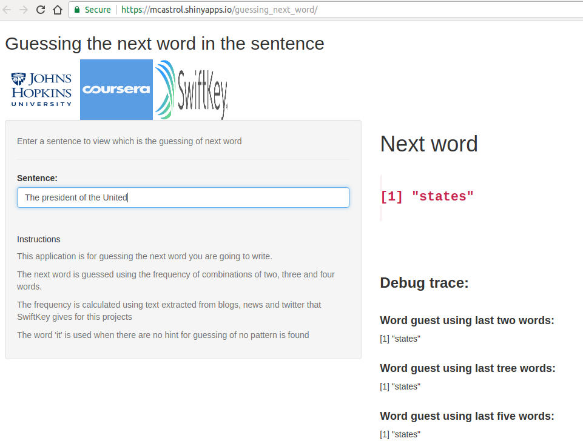
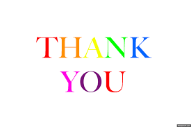

```{r setup, include=FALSE}
knitr::opts_chunk$set(echo = FALSE)
```
<style>
.title-slide {
  background-color: #D3B2FF; /* #EDE0CF; ; #CA9F9D*/}
</style>

## Introduction 


The application named **Guessing next word in a sentence**  is done to
show the model of Natural Language Processing created during the Data Science Captone Project Course.

This course is developed by the John Hopkins University, available in Coursera.
The data used in this project was given by SwiftKey company.

```{r, echo=FALSE, out.width = '15%'}
knitr::include_graphics(c("JHU-Logo.png","coursera.png","swiftkey.png"), )
```

## Natural Language Processing Model

- The next word is guessed using the frequency of combinations of two, three and four words.

- The frequency is calculated using text extracted from blogs, news and twitter that SwiftKey  gives for this projects"),

- The word 'it' is used when there are no hint for guessing of no pattern is 


## Performance

- The data preparation for this model takes around 40 minuts. 
- This process takes the original data composed by news, blogs and twitters that have 2.5Millons of lines and 550MB, and it selects 50.000 random lines to create the frequency tables with the combination of two, three, and four words. 
- The output of this process is the data used by this app. The total size is 3Mb.
- The time required by the app to search the next word in the frequency tables is 0.30seg in average.


## Shiny application

- The shiny application is available in
https://mcastrol.shinyapps.io/guessing_next_word/

- You can also download it from github repository 
https://github.com/mcastrol/dataScienceCaptoneProject


## Instructions to run it 

- Access to the application https://mcastrol.shinyapps.io/guessing_next_word/
- Enter the sentence. While you are entering, the app shows the next word and the word found it in the frequency tables for two, three and four words,

```{r, echo=FALSE, fig.cap="App user interface", out.width = '50%'}

```

## 
```{r, echo=FALSE, out.width = '100%'}

```